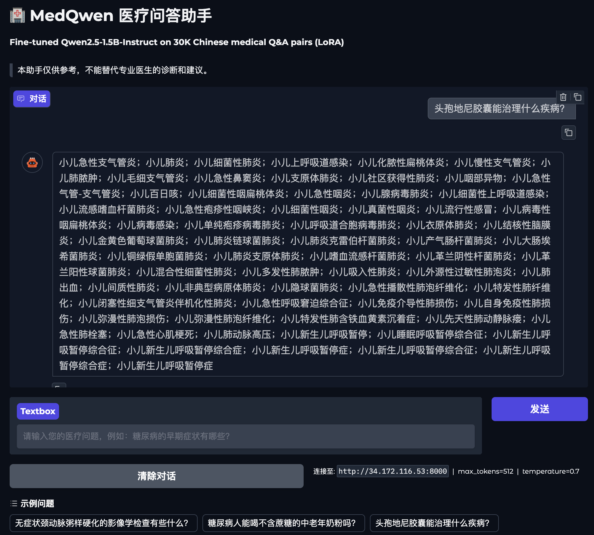
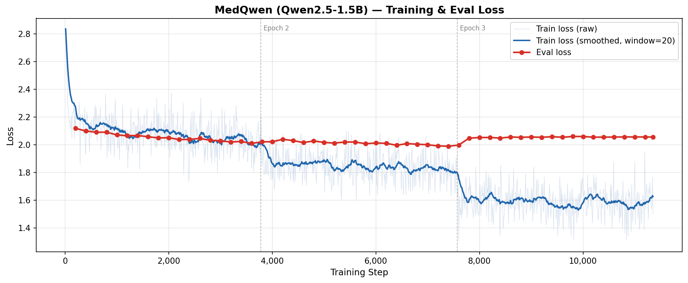
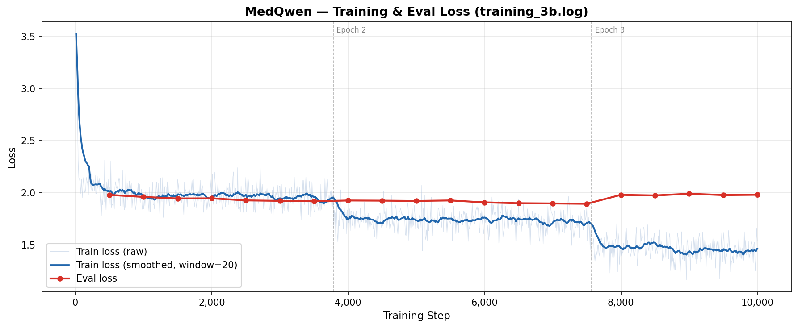
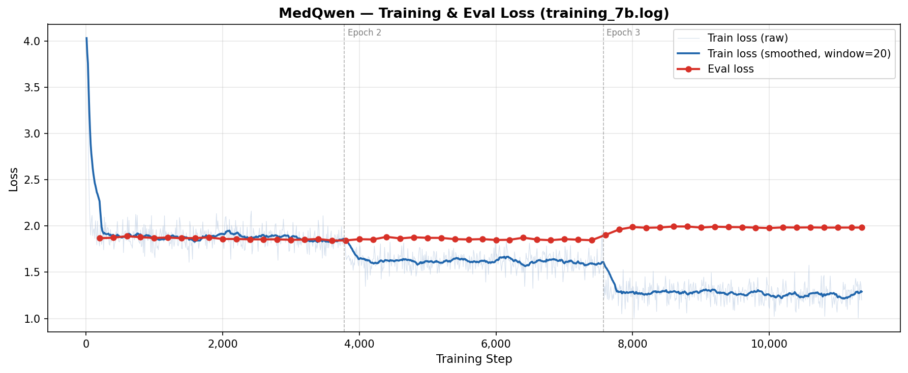

HnIt# MedQwen — Chinese Medical Q&A Fine-Tuning

LoRA fine-tuning of Qwen2.5-Instruct on 30K Chinese medical dialogue pairs, with multi-metric evaluation and a Gradio chatbot demo.

---

## Demo



> Gradio chatbot UI served via vLLM on GCP L4 GPU.

---

## ML Pipeline

```
┌─────────────────────────────────────────────────────────────────┐
│                        DATA PREPARATION                         │
│                                                                 │
│  medical_train.txt  ──┐                                         │
│  medical_valid.txt  ──┴─► resplit_data.py ─► 80/10/10 split    │
│                          convert_data.py  ─► JSONL chat format  │
└─────────────────────────────────────────────────────────────────┘
                              │
                              ▼
┌─────────────────────────────────────────────────────────────────┐
│                           TRAINING                              │
│                                                                 │
│  Qwen2.5-Instruct (frozen base weights)                         │
│       +                                                         │
│  LoRA Adapters  r=8 / r=16  (trainable ~1% params)             │
│                                                                 │
│  FP16 autocast · gradient checkpointing · cosine LR schedule   │
│  gradient accumulation · early stopping (patience=5)           │
└─────────────────────────────────────────────────────────────────┘
                              │
                              ▼
┌─────────────────────────────────────────────────────────────────┐
│                         EVALUATION                              │
│                                                                 │
│  ROUGE  (character-level tokenization for Chinese)              │
│  BERTScore  (bert-base-chinese semantic similarity)             │
└─────────────────────────────────────────────────────────────────┘
                              │
                              ▼
┌─────────────────────────────────────────────────────────────────┐
│                           SERVING                               │
│                                                                 │
│  MLX-LM  (Apple Silicon, port 8080)                             │
│  vLLM    (CUDA GPU, port 8000)      ──► Gradio UI (port 7860)  │
└─────────────────────────────────────────────────────────────────┘
```

---

## Results

### Model Scale Comparison (all r=8, lr=2e-4)

| Model | ROUGE-1 Δ | ROUGE-L Δ | BERTScore (base) | BERTScore (ft) | Δ |
|-------|-----------|-----------|-----------------|----------------|---|
| Qwen2.5-1.5B | -2.39% | -2.39% | 0.6059 | 0.6620 | +5.61% |
| Qwen2.5-3B   | +2.04% | +1.70% | 0.6159 | 0.6683 | +5.24% |
| Qwen2.5-7B   | -0.77% | -0.59% | 0.5959 | 0.6670 | +7.11% |

### LoRA Rank Ablation (Qwen2.5-3B, lr=2e-4)

| Rank | BERTScore (base) | BERTScore (ft) | Δ |
|------|-----------------|----------------|---|
| r=8  | 0.6159 | 0.6683 | +5.24% |
| r=16 | 0.6159 | 0.6751 | +5.92% |

> **Key findings:**
> - BERTScore (semantic similarity) is the primary metric for open-ended Chinese generation — ROUGE is less reliable as fine-tuned models learn to give concise, on-format answers.
> - The 7B model achieves the highest absolute BERTScore improvement (+7.11%), consistent with larger models having more capacity to absorb domain-specific patterns.
> - Higher LoRA rank (r=16) outperforms r=8 on the 3B model (+5.92% vs +5.24%) when learning rate is held constant.

### Training Loss Curves

| 1.5B (Apple M5) | 3B (GCP L4) | 7B (GCP L4) |
|:-:|:-:|:-:|
|  |  |  |

---

## Tech Stack

- **Model**: Qwen2.5-1.5B / 3B / 7B-Instruct
- **Fine-tuning**: LoRA via PEFT (`r=8/16`, `alpha=2×rank`, 7 target modules)
- **Training**: PyTorch, gradient accumulation, FP16 autocast, early stopping
- **Hardware**: Apple M5 MPS (1.5B) · GCP L4 24GB (3B, 7B)
- **Serving**: MLX-LM (Apple Silicon) · vLLM (CUDA)
- **UI**: Gradio
- **Evaluation**: ROUGE (character-level), BERTScore (bert-base-chinese)

---

## Project Structure

```
MedQwen/
├── src/
│   ├── config.py              # centralized hyperparameters and paths
│   ├── train.py               # LoRA fine-tuning loop
│   ├── evaluate.py            # ROUGE + BERTScore evaluation
│   ├── inference_test.py      # qualitative base vs fine-tuned comparison
│   ├── plot_loss.py           # training loss curve plotting
│   ├── LLM-as-judge.py        # GPT-4o judge evaluation
│   ├── app.py                 # Gradio chatbot UI
│   ├── data/
│   │   ├── convert_data.py    # producer-consumer txt → JSONL pipeline
│   │   └── resplit_data.py    # 80/10/10 train/val/test split
│   └── serve/
│       ├── mlx_serve.py       # MLX-LM OpenAI-compatible server (Mac)
│       └── vllm_serve.py      # vLLM OpenAI-compatible server (GPU)
├── data/
│   ├── medical_train.jsonl
│   ├── medical_valid.jsonl
│   └── medical_test.jsonl
├── assets/
│   ├── frontend.png
│   ├── loss_curve.png
│   ├── loss_curve_3b.png
│   └── loss_curve_7b.png
├── logs/
│   └── training_*.log
├── model_cards/
│   ├── MODEL_CARD_7B.md
│   ├── MODEL_CARD_3B.md
│   └── MODEL_CARD_3B_r16.md
├── checkpoints/
│   └── best/                  # saved LoRA adapter weights
└── requirements.txt
```

---

## Setup

```bash
git clone https://github.com/melc030/MedQwen.git
cd MedQwen
python -m venv .venv && source .venv/bin/activate
pip install -r requirements.txt
```

### Download base model

```bash
huggingface-cli download Qwen/Qwen2.5-3B-Instruct --local-dir Qwen2.5-3B-Instruct
```

### Prepare data

```bash
# re-split into 80/10/10 train/val/test
python src/data/resplit_data.py

# convert txt → JSONL chat format
python src/data/convert_data.py
```

### Train

```bash
python src/train.py
```

### Evaluate

```bash
python src/evaluate.py
```

### Plot loss curve

```bash
python src/plot_loss.py logs/training.log assets/loss_curve.png
```

### Run chatbot

**Option A — Apple Silicon Mac (MLX-LM, port 8080)**
```bash
python -m mlx_lm.fuse \
  --model Qwen2.5-1.5B-Instruct \
  --adapter-path checkpoints/best \
  --save-path checkpoints/mlx-medqwen

python src/serve/mlx_serve.py
```

**Option B — Cloud GPU / CUDA (vLLM, port 8000)**
```bash
pip install vllm
python src/serve/vllm_serve.py
```

Terminal 2 — launch Gradio UI:
```bash
python src/app.py
INFERENCE_URL=http://localhost:8000 python src/app.py   # point at vLLM
INFERENCE_URL=http://<vm-ip>:8000 python src/app.py     # point at remote GPU
```

Open `http://localhost:7860`

---

## Trained Models

| Model | HuggingFace |
|-------|-------------|
| Qwen2.5-7B LoRA (r=8) | [mellee030/MedQwen-7B-LoRA](https://huggingface.co/mellee030/MedQwen-7B-LoRA) |
| Qwen2.5-3B LoRA (r=8) | [mellee030/MedQwen-3B-LoRA](https://huggingface.co/mellee030/MedQwen-3B-LoRA) |
| Qwen2.5-3B LoRA (r=16) | [mellee030/MedQwen-3B-LoRA-r16](https://huggingface.co/mellee030/MedQwen-3B-LoRA-r16) |

---

## Dataset

~30,900 Chinese medical Q&A pairs derived from a structured Chinese medical knowledge base (`medical.json`, ~45MB), which contains disease records with fields such as name, description, symptoms, causes, and treatments — originally exported from a MongoDB collection. The raw records were converted into Q&A dialogue pairs and formatted into Qwen2.5 chat template format (system / user / assistant).

The dataset is split 80/10/10 into three non-overlapping subsets:

| Split | Samples | Purpose |
|-------|---------|---------|
| **Train** (80%) | ~24,700 | Model weight updates during fine-tuning |
| **Validation** (10%) | ~3,090 | Early stopping — evaluated every 500 steps to decide when to stop training and which checkpoint to save |
| **Test** (10%) | ~3,090 | Final evaluation only — never seen during training, provides an unbiased BERTScore and ROUGE report |

The train/validation/test split is shuffled with a fixed seed (`seed=42`) before splitting to ensure reproducibility. The validation set drives training decisions (early stopping), so a separate test set is required to report honest final metrics — using the validation set for both would inflate reported performance.
