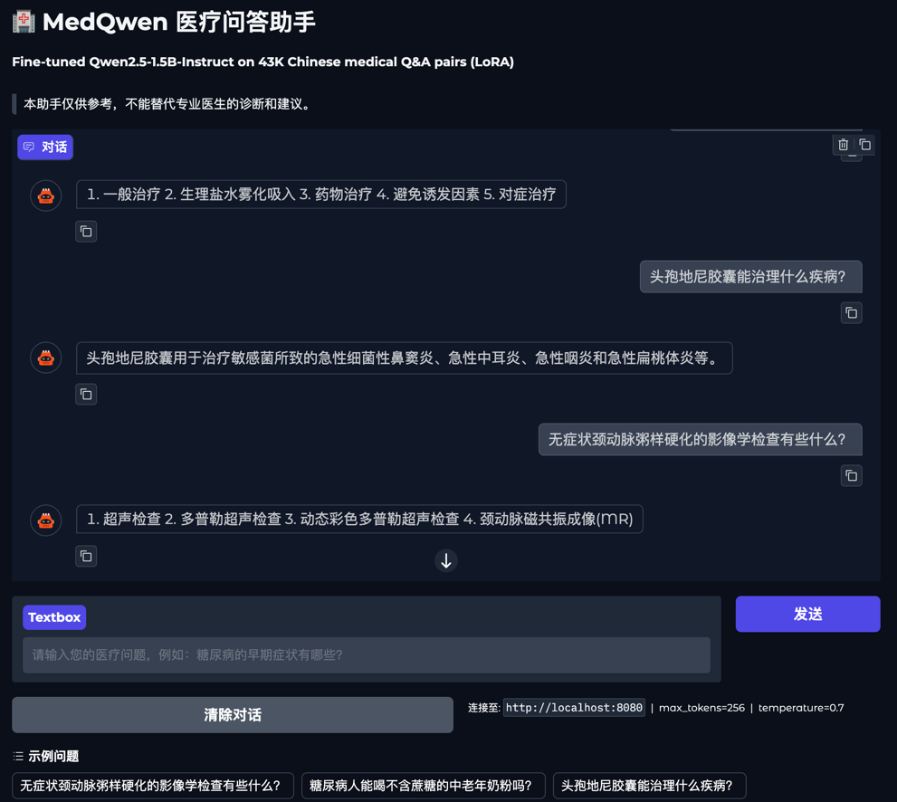

# MedQwen — Chinese Medical Q&A Fine-Tuning

LoRA fine-tuning of Qwen1.5-Instruct on 43K Chinese medical Q&A pairs, with multi-metric evaluation and a Gradio chatbot demo.

---

## Demo



> Gradio chatbot UI served via vLLM on GCP L4 GPU.

---

## ML Pipeline

```
┌─────────────────────────────────────────────────────────────────┐
│                        DATA PREPARATION                         │
│                                                                 │
│  medical.json (8,807 diseases)                                  │
│       └─► generate_qa.py ─► 14 Q&A templates per disease       │
│                           ─► filter answers ≥ 15 chars          │
│                           ─► 80/10/10 train/val/test split      │
└─────────────────────────────────────────────────────────────────┘
                              │
                              ▼
┌─────────────────────────────────────────────────────────────────┐
│                           TRAINING                              │
│                                                                 │
│  Qwen2.5-Instruct (frozen base weights)                         │
│       +                                                         │
│  LoRA Adapters  r=16  (trainable ~0.5% params)                  │
│                                                                 │
│  FP16 autocast · gradient checkpointing · cosine LR schedule   │
│  gradient accumulation · early stopping (patience=5)           │
└─────────────────────────────────────────────────────────────────┘
                              │
                              ▼
┌─────────────────────────────────────────────────────────────────┐
│                         EVALUATION                              │
│                                                                 │
│  ROUGE  (character-level tokenization for Chinese)              │
│  BERTScore  (bert-base-chinese semantic similarity)             │
└─────────────────────────────────────────────────────────────────┘
                              │
                              ▼
┌─────────────────────────────────────────────────────────────────┐
│                           SERVING                               │
│                                                                 │
│  MLX-LM  (Apple Silicon, port 8080)                             │
│  vLLM    (CUDA GPU, port 8000)      ──► Gradio UI (port 7860)  │
└─────────────────────────────────────────────────────────────────┘
```

---

## Results

### MedQwen-1.5B-LoRA-medrag

| Metric | Base Qwen2.5-1.5B | Fine-tuned | Δ |
|--------|------------------|------------|---|
| ROUGE-1 | 0.1139 | 0.1470 | +3.31% |
| ROUGE-2 | 0.0691 | 0.0861 | +1.70% |
| ROUGE-L | 0.1077 | 0.1339 | +2.63% |
| **BERTScore** | **0.6235** | **0.7203** | **+9.68%** |

> Evaluated on 200 randomly sampled held-out test pairs (seed=42). BERTScore uses `bert-base-chinese`. ROUGE uses character-level tokenization for Chinese.

### MedQwen vs MedGraphRAG (head-to-head)

| System | BERTScore (F1) |
|--------|---------------|
| **MedQwen (fine-tuned 1.5B)** | **0.7561** |
| MedGraphRAG (RAG pipeline) | 0.7190 |

> 400 stratified test questions (35 per question type, 13 types). Both systems answer the same questions; BERTScore is computed against the same ground-truth references.

> **Key findings:**
> - BERTScore (semantic similarity) is the primary metric for open-ended Chinese generation — ROUGE is less reliable as fine-tuned models learn concise, on-format answers.
> - Positive ROUGE deltas indicate the model matches the style and structure of the dataset answers, not just the semantics.
> - The medgraphrag dataset (+9.68%) outperforms the previous medical split dataset (+6.57%) — richer templates and more diverse coverage improve fine-tuning quality.

---

## Tech Stack

- **Model**: Qwen2.5-1.5B-Instruct
- **Fine-tuning**: LoRA via PEFT (`r=16`, `alpha=32`, 7 target modules)
- **Training**: PyTorch, gradient accumulation, FP16 autocast, early stopping
- **Hardware**: GCP L4 24GB
- **Serving**: MLX-LM (Apple Silicon) · vLLM (CUDA)
- **UI**: Gradio
- **Evaluation**: ROUGE (character-level), BERTScore (bert-base-chinese)

---

## Project Structure

```
MedQwen/
├── src/
│   ├── config.py              # centralized hyperparameters and paths
│   ├── train.py               # LoRA fine-tuning loop
│   ├── plot_loss.py           # training loss curve plotting
│   ├── app.py                 # Gradio chatbot UI
│   ├── eval/
│   │   ├── evaluate.py        # ROUGE + BERTScore evaluation (base vs fine-tuned)
│   │   ├── compare_eval.py    # MedQwen vs MedGraphRAG comparison (BERTScore)
│   │   └── collect_medgraphrag_answers.py  # query MedGraphRAG for answers
│   ├── data/
│   │   ├── convert_data.py    # raw data format conversion
│   │   └── resplit_data.py    # 80/10/10 train/val/test split utility
│   └── serve/
│       ├── mlx_serve.py       # MLX-LM OpenAI-compatible server (Mac)
│       └── vllm_serve.py      # vLLM OpenAI-compatible server (GPU)
├── data/                          # gitignored except data_examples.jsonl
│   ├── MedDataGen/
│   │   ├── generate_qa.py     # Q&A generation script
│   │   └── medical.json       # source knowledge base (8,807 diseases)
│   ├── medgraphrag_qa_clean/  # generated train/val/test splits
│   └── data_examples.jsonl    # 8 representative Q&A samples
├── assets/
│   └── demo.png
├── logs/
│   └── training_*.log
├── model_cards/
│   ├── MODEL_CARD_1.5B_medrag.md
│   ├── MODEL_CARD_1.5B_r16.md
│   ├── MODEL_CARD_3B.md
│   ├── MODEL_CARD_3B_r16.md
│   ├── MODEL_CARD_7B.md
│   └── MODEL_CARD_7B_r16.md
├── checkpoints/
│   └── best/                  # saved LoRA adapter weights
└── requirements.txt
```

---

## Setup

```bash
git clone https://github.com/melc030/MedQwen.git
cd MedQwen
python -m venv .venv && source .venv/bin/activate
pip install -r requirements.txt
```

### Configure

All hyperparameters and paths are centralized in `src/config.py`. Key settings to review before training:

| Parameter | Default | Description |
|-----------|---------|-------------|
| `hf_model_id` | `Qwen/Qwen2.5-1.5B-Instruct` | Base model from HuggingFace |
| `lora_rank` | 16 | LoRA rank (higher = more capacity, more VRAM) |
| `lora_alpha` | 32 | LoRA scaling factor (typically 2x rank) |
| `lora_target_modules` | 7 projection layers | Which layers to apply LoRA to |
| `batch_size` | 1 | Per-device batch size |
| `grad_accum_steps` | 8 | Effective batch size = batch_size x grad_accum_steps |
| `epochs` | 3 | Maximum training epochs |
| `learning_rate` | 2e-4 | Peak learning rate (cosine schedule) |
| `max_seq_len` | 256 | Maximum sequence length |
| `save_steps` | 1000 | Evaluate & checkpoint every N steps |
| `early_stopping_patience` | 5 | Stop if eval loss doesn't improve for N evaluations |

To switch to a different base model (e.g. 7B), update `hf_model_id` and `model_path` in `config.py`.

### Download base model

```bash
hf download Qwen/Qwen2.5-1.5B-Instruct --local-dir Qwen2.5-1.5B-Instruct
```

### Prepare data

```bash
# generate Q&A pairs from medical.json, filter short answers, split 80/10/10
python data/MedDataGen/generate_qa.py --min-answer 15 --split
```

### Train

```bash
python src/train.py
```

### Evaluate

```bash
python src/eval/evaluate.py
```

### Plot loss curve

```bash
python src/plot_loss.py logs/training_1.5b_mg.log assets/loss_curve.png
```

### Inference

The inference pipeline has two steps: (1) start an inference server, (2) launch the Gradio chatbot UI.

**Step 1 — Download the LoRA adapter from HuggingFace**

```bash
hf download mellee030/MedQwen-1.5B-LoRA-medrag --local-dir checkpoints/best
```

**Step 2 — Start the inference server**

**Option A — Apple Silicon Mac (MLX-LM, port 8080)**
```bash
# Fuse LoRA adapter into MLX format (one-time)
python -m mlx_lm fuse --model Qwen2.5-1.5B-Instruct --adapter-path checkpoints/best --save-path checkpoints/mlx-medqwen

# Start server
python src/serve/mlx_serve.py
```

**Option B — Cloud GPU / CUDA (vLLM, port 8000)**
```bash
pip install vllm
python src/serve/vllm_serve.py
```

**Step 3 — Launch Gradio chatbot UI** (in a separate terminal)

```bash
python src/app.py                                        # default: connects to MLX on port 8080
INFERENCE_URL=http://localhost:8000 python src/app.py     # point at vLLM
INFERENCE_URL=http://<vm-ip>:8000 python src/app.py      # point at remote GPU
```

Open `http://localhost:7860`

---

## Trained Models

| Model | HuggingFace |
|-------|-------------|
| Qwen2.5-1.5B LoRA (r=16, medrag) | [mellee030/MedQwen-1.5B-LoRA-medrag](https://huggingface.co/mellee030/MedQwen-1.5B-LoRA-medrag) |

---

## Dataset

54,095 Chinese medical Q&A pairs generated from `medical.json` — a structured knowledge base of 8,807 disease records originally from the [MedGraphRAG](https://github.com/MedicineToken/Medical-Graph-RAG) project. Each disease record contains fields such as name, description, symptoms, causes, treatments, medications, diet restrictions, and more.

Each disease produces up to 14 Q&A pairs from fixed templates:

| Template | Example question |
|----------|-----------------|
| 是什么病 | 肺泡蛋白质沉积症是什么病？ |
| 症状有哪些 | 肺泡蛋白质沉积症的症状有哪些？ |
| 病因是什么 | 肺泡蛋白质沉积症的病因是什么？ |
| 怎么预防 | 肺泡蛋白质沉积症怎么预防？ |
| 治疗方法有哪些 | 肺泡蛋白质沉积症的治疗方法有哪些？ |
| 需要做哪些检查 | 肺泡蛋白质沉积症需要做哪些检查？ |
| 推荐药物有哪些 | 肺泡蛋白质沉积症的推荐药物有哪些？ |
| 并发症有哪些 | 肺泡蛋白质沉积症的并发症有哪些？ |
| 应该去哪个科室 | 肺泡蛋白质沉积症应该去哪个科室就诊？ |
| 适合吃什么 | 肺泡蛋白质沉积症患者适合吃什么食物？ |
| 不能吃什么 | 肺泡蛋白质沉积症患者不能吃什么？ |
| 传播方式 | 肺泡蛋白质沉积症的传播方式是什么？ |
| 治愈率 | 肺泡蛋白质沉积症的治愈率是多少？ |
| 治疗周期 | 肺泡蛋白质沉积症的治疗周期大概是多久？ |

Pairs with answers shorter than 15 characters are filtered out to remove low-information entries (e.g. single-word answers), leaving 54,095 pairs. Split 80/10/10 with seed=42:

| Split | Samples | Purpose |
|-------|---------|---------|
| **Train** (80%) | 43,276 | Model weight updates during fine-tuning |
| **Validation** (10%) | 5,409 | Early stopping — evaluated every 1,000 steps |
| **Test** (10%) | 5,410 | Final evaluation only — never seen during training |
